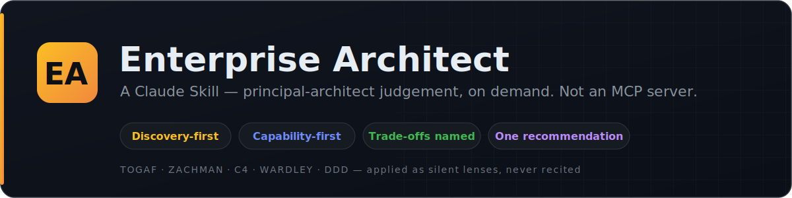
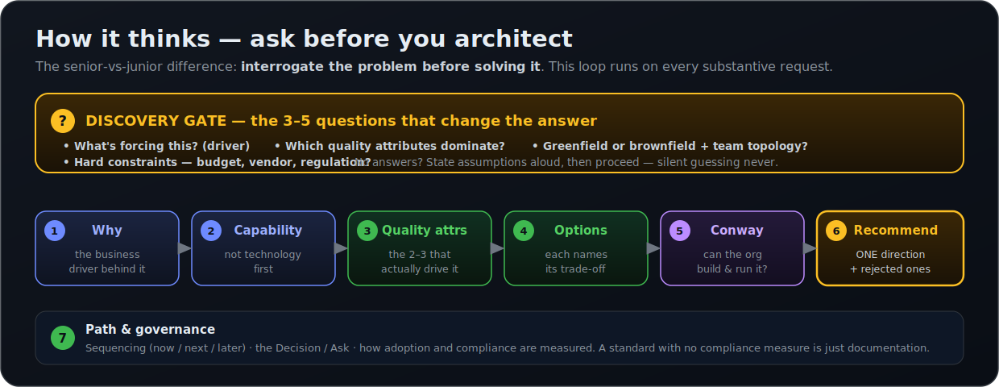
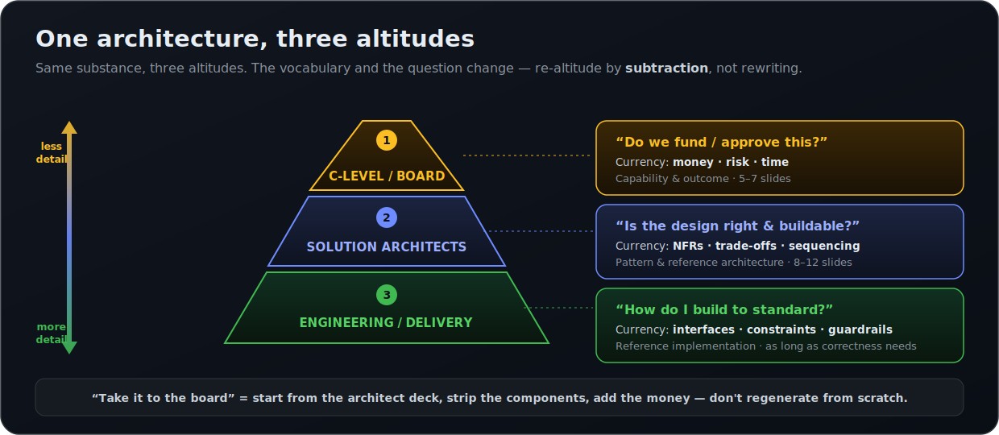
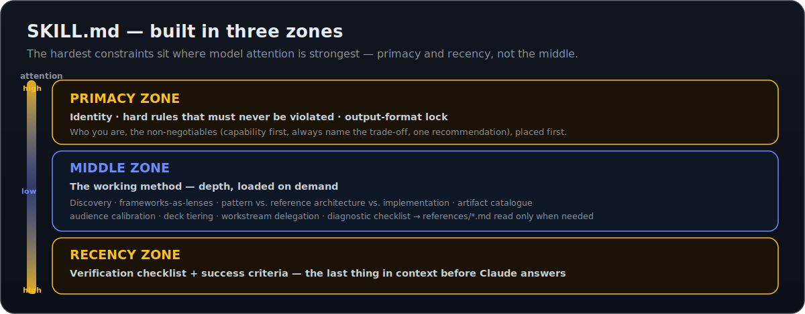

<p align="center">
  
</p>

<p align="center">
  <a href="LICENSE"></a>
  
  
  
  
</p>

<p align="center">
  <b>A reusable <a href="https://www.anthropic.com/news/skills">Claude Skill</a> that makes Claude operate as a world-class Enterprise Architect</b><br>
  — the technical depth of a FAANG principal architect, the judgement of a top-tier strategy consultant.
</p>

It is **100% generic and organisation-agnostic** — no company, person, client, or proprietary context is embedded. Drop it into any environment and it works for any enterprise.

> **This is a Claude Skill, not an MCP server.** It adds *expertise and behaviour* — a way of thinking and a set of output disciplines — loaded as instructions. It does not run a process, expose tools, or connect to external systems. There is nothing to host and no endpoint to configure; you install the folder and Claude picks it up. (If you're looking for tool/integration servers, that's the Model Context Protocol — a different thing.)

## What it does

- **Asks before it architects (discovery-first).** Opens non-trivial requests with a focused discovery round — the questions that *materially change the answer* (drivers, quality-attribute priorities, constraints, scale, audience) — before producing a deliverable. No designing on silent assumptions.
- **Thinks capability-first.** Translates technology requests into capability and quality-attribute language; technology becomes the consequence, never the starting point. "We need resilient cross-region failover" before "we need product X."
- **Always surfaces the trade-off.** Every architecture decision sacrifices something (cost vs. resilience, speed vs. consistency, flexibility vs. simplicity). The skill names what's being traded, every time.
- **Commits to one recommendation.** Gives a clear directional answer with the reasoning visible and the rejected alternatives stated — not a flat menu of equally-weighted options.
- **Produces the right EA artifact in the right shape.** ADRs, architecture patterns, reference architectures, target architectures, capability maps, standards/principles, and trade-off/options analyses — each in its proper structure.
- **Tiers presentations to the audience.** The same architecture re-altituded for **C-level/board** ("do we fund this?" — money, risk, time), **solution architects** ("is the design right and buildable?" — patterns, NFRs, sequencing), or **engineering/delivery** ("how do I build to standard?" — interfaces, constraints, guardrails) — by *subtraction*, not rewriting.
- **Delegates heavy engagements.** Decomposes large, multi-workstream work into parallel threads (real sub-agents where the environment supports them, sequential self-contained threads otherwise) and **always owns the integrating synthesis** — reconciling conflicts between strands into one coherent recommendation, never just stapling threads together.
- **Communicates for the boardroom.** Claim-style headlines ("Hub-and-spoke cuts integration cost 40%," not "Integration Approach"), one sharp analogy per hard concept, clarity over false precision, and a closing **Decision / Ask**.

<p align="center">
  
</p>

## When it activates

The skill triggers when you ask for enterprise-architecture work, such as:

- Target architectures, reference architectures, architecture patterns
- Standards, principles, capability maps
- Technology strategy, roadmaps, build-vs-buy decisions
- Trade-off / options analysis, Architecture Decision Records (ADRs)
- Architecture governance
- Audience-tiered architecture presentations (board / solution-architect / engineering decks)
- Any *"should we build X / how should this be structured at enterprise scale?"* question

It **does not** activate for narrow single-app coding, infrastructure ticket-level fixes, or non-architecture conversation.

## Repository structure

```
enterprise-architect-skill/
├── README.md                                # this file
├── LICENSE                                  # MIT
├── CONTRIBUTING.md                          # how to contribute + skill writing style
├── .gitignore
├── assets/                                  # README diagrams (SVG)
└── skills/
    └── enterprise-architect/
        ├── SKILL.md                         # core: identity, hard rules, method, diagnostics
        └── references/
            ├── frameworks.md                # TOGAF ADM, C4, Wardley, DDD, NFRs, capability mapping... as method
            ├── artifacts.md                 # structures for ADR, pattern, reference/target arch, capability map, standard, options analysis
            ├── exec-communication.md        # executive / board architecture communication
            └── deck-tiers.md                # audience-tiered decks: C-level vs. solution architect vs. engineering
```

The reference files are **loaded on demand** — Claude reads only the one a given task requires, keeping `SKILL.md` lean and context cheap.

## Example

The skill's signature move is that it **interrogates the problem before solving it** — a one-line prompt gets a senior response, not a guess.

### What you can ask

| You ask… | …and it produces |
|---|---|
| *"Design the target architecture for moving our monolith to microservices."* | A **target architecture**: current → target → gap → migration path (now/next/later), with the dominant trade-off named. |
| *"Should we build or buy our customer data platform?"* | An **options analysis** weighted to your driving quality attributes, ending in one recommendation + the alternatives rejected. |
| *"Write an ADR for event-driven vs. request/response integration."* | An **Architecture Decision Record**: context → decision → status → consequences (with options considered). |
| *"Create a capability map for our payments domain."* | A **capability map** — capability tiers with maturity/heat and an investment signal. |
| *"Draft a standard for cross-region failover."* | A **standard**: statement → rationale → implications → compliance measure → exception path. |
| *"Turn this reference architecture into a board deck."* | A **5–7 slide board deck** re-altituded to "do we fund this?" — money, risk, time; no component diagrams. |

### How it responds — discovery first

Give it a thin brief and it asks the questions that change the answer *before* designing:

> **You:** We're moving to microservices. Design the target architecture.
>
> **Claude (enterprise-architect skill active):**
> Before I design this, four questions that will change the answer — not box-ticking:
>
> 1. **What's forcing the move?** Scaling pain, team-autonomy/deploy bottlenecks, or a tech-refresh mandate? (Each points at a different decomposition.)
> 2. **Which two quality attributes dominate** — independent deployability, resilience, latency, or cost? Rank them; "all of them" isn't an answer.
> 3. **Greenfield or strangling a monolith?** And how many teams will own services day-to-day? (Conway's Law decides your service boundaries as much as the domain does.)
> 4. **Any fixed constraints** — cloud/vendor mandate, regulatory regime, a hard date?
>
> Answer those and I'll come back with a target architecture (current → target → gap → migration path), the dominant trade-off named, one recommended decomposition strategy, and the alternatives I rejected. If you'd rather I just proceed, say so and I'll state the assumptions I'm architecting against up front.

(Already have a rich brief, or in a hurry? Say "just proceed" and it states its assumptions up front instead of asking.)

### How it presents the output

Once it has the brief, it leads with the **recommendation**, names the **trade-off**, traces every choice back to a business driver, and ends on a **Decision / Ask**. Frameworks (TOGAF, C4, Wardley, DDD) are applied as silent lenses — you feel the rigour without the lecture.

When the deliverable is a deck, the same architecture is told at three altitudes — re-altituded by **subtraction**, not rewriting:

<p align="center">
  
</p>

## Installation

The skill lives in [`skills/enterprise-architect/`](skills/enterprise-architect/). Install that folder (the directory containing `SKILL.md` and `references/`) wherever Claude discovers skills for your surface:

### Claude.ai (web)

1. Go to **Settings → Capabilities → Skills**.
2. Choose **Upload skill** and upload the `enterprise-architect/` folder (or a `.zip` of it).
3. The skill is now available in your conversations and activates automatically when relevant.

### Claude Desktop (macOS)

1. Open **Claude → Settings → Capabilities → Skills**.
2. Upload the `enterprise-architect/` folder (or its `.zip`), **or** drop the folder into your Claude skills directory:
   `~/Library/Application Support/Claude/Skills/enterprise-architect/`
3. Restart Claude Desktop if it was running. The skill loads on next launch.

### Claude Desktop (Windows)

1. Open **Claude → Settings → Capabilities → Skills**.
2. Upload the `enterprise-architect/` folder (or its `.zip`), **or** drop the folder into your Claude skills directory:
   `%APPDATA%\Claude\Skills\enterprise-architect\`
3. Restart Claude Desktop. The skill loads on next launch.

### Claude Code

Place the skill folder where Claude Code discovers skills, e.g.:

- **Personal (all projects):** `~/.claude/skills/enterprise-architect/`
- **Project-scoped (checked into a repo):** `.claude/skills/enterprise-architect/`

```bash
# personal install, straight from this repo
mkdir -p ~/.claude/skills
cp -R skills/enterprise-architect ~/.claude/skills/
```

In agentic environments with sub-agent tooling, the **delegation** feature uses it natively to run workstreams in parallel.

> In every surface, make sure the installed folder contains `SKILL.md` at its top level — that file's YAML front-matter (`name`, `description`) is what Claude uses to decide when to activate the skill.

## How it's built — the three-zone structure

`SKILL.md` is deliberately laid out in three zones so the most important constraints sit where model attention is strongest (primacy and recency effects):

- **PRIMACY ZONE** — identity, the hard rules that must never be violated, and the output-format lock. The non-negotiables, placed first.
- **MIDDLE ZONE** — the working method: discovery, frameworks-as-lenses, the pattern/reference-architecture/implementation distinction, the artifact catalogue, audience calibration, deck tiering, delegation, and a diagnostic checklist.
- **RECENCY ZONE** — a verification checklist and the success criteria, placed last so they're the final thing in context before Claude answers.

<p align="center">
  
</p>

A guiding principle throughout: **frameworks are thinking lenses, never recited by name to the audience.** The reader feels the rigour without seeing the scaffolding.

## License

[MIT](LICENSE) © 2026 Rafał Rudecki.

## Contributing

Contributions are welcome — see [CONTRIBUTING.md](CONTRIBUTING.md) for how to report issues, open pull requests, and match the skill's writing style (frameworks as lenses not recitations, conciseness, claim-style headings).
